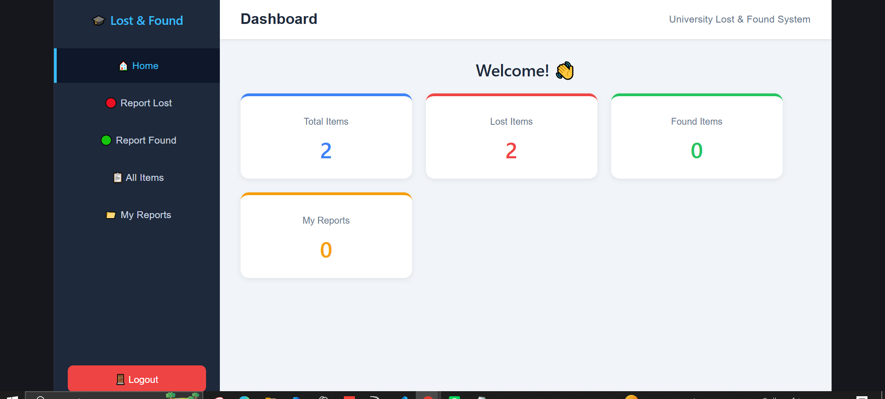
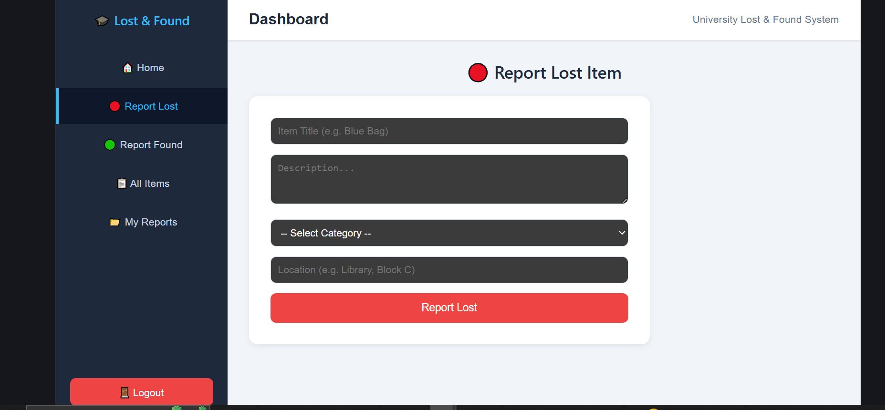
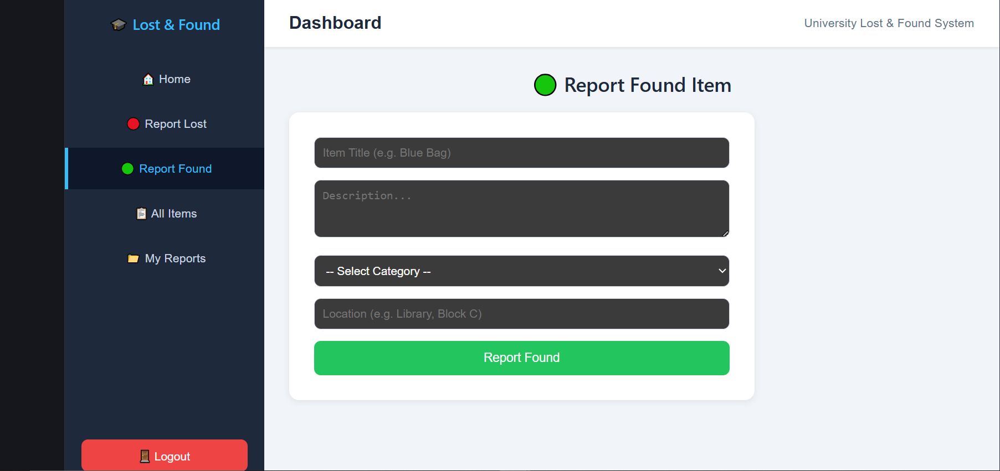
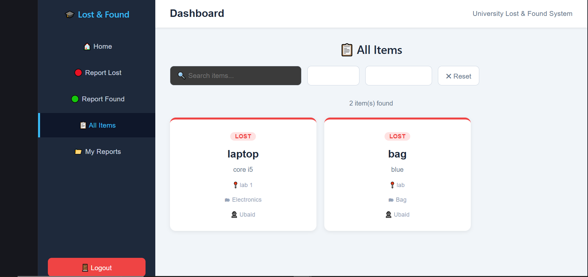
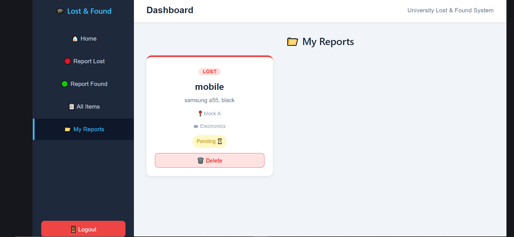
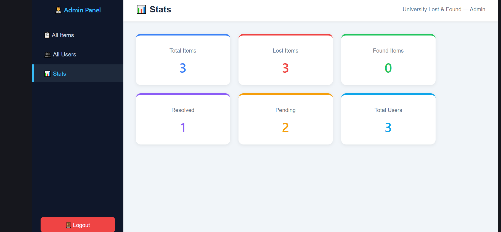
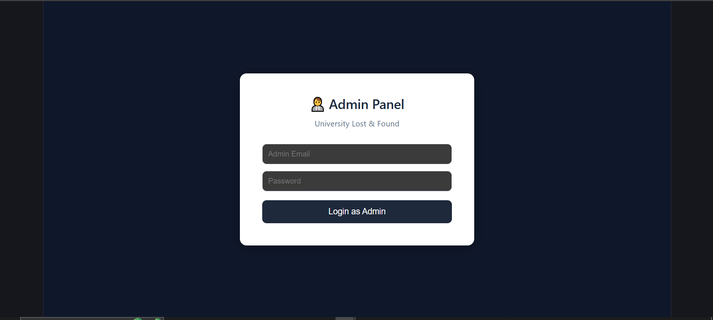
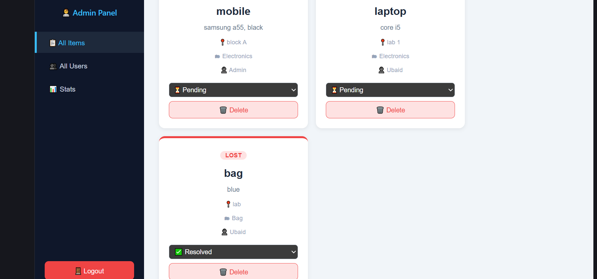
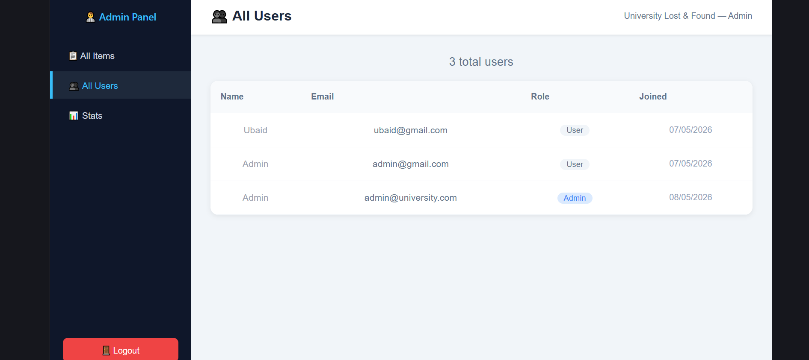

Got it! Here is the full README:

---

# 🔍 Lost & Found System

A full-stack web application built for university use that allows students and staff to report lost or found items. Admins can manage all reports and users through a dedicated dashboard.

---

## 🚀 Tech Stack

**Frontend**
- React 19 (Vite)
- React Router DOM v7
- Axios
- React Hot Toast

**Backend**
- Node.js + Express 5
- MongoDB + Mongoose
- JWT Authentication
- Bcryptjs (password hashing)
- Cloudinary + Multer (image uploads)

---

## ✨ Features

### 👤 User
- Sign up and log in securely
- Report a **lost** item with title, description, category, and location
- Report a **found** item
- View all reported items (lost & found)
- View and delete your own reported items
- View stats on the dashboard

### 🛡️ Admin
- Separate admin login at `/admin/login`
- View all items reported by all users
- Update item status (`pending` → `resolved`)
- Delete any item
- View all registered users

---

## 📁 Project Structure

```
Lost_Found_system/
├── backend/
│   ├── models/
│   │   ├── Item.js
│   │   └── User.js
│   ├── routes/
│   │   ├── authRoutes.js
│   │   ├── itemRoutes.js
│   │   └── adminRoutes.js
│   ├── .env.example
│   ├── createAdmin.js
│   └── server.js
│
└── frontend/
    ├── src/
    │   ├── components/
    │   │   ├── Navbar.jsx
    │   │   ├── Sidebar.jsx
    │   │   └── ProtectedRoute.jsx
    │   ├── layouts/
    │   │   └── DashboardLayout.jsx
    │   ├── pages/
    │   │   ├── Login.jsx
    │   │   ├── Signup.jsx
    │   │   ├── Dashboard.jsx
    │   │   ├── ReportLost.jsx
    │   │   ├── ReportFound.jsx
    │   │   ├── AllItems.jsx
    │   │   ├── MyItems.jsx
    │   │   ├── AdminLogin.jsx
    │   │   └── AdminDashboard.jsx
    │   └── App.jsx
    └── index.html
```

---

## ⚙️ Getting Started

### Prerequisites
- Node.js installed
- MongoDB URI (local or MongoDB Atlas)

---

### 1. Clone the Repository

```bash
git clone https://github.com/Ubaid-SE/Lost_Found_system.git
cd Lost_Found_system
```

### 2. Setup Backend

```bash
cd backend
npm install
```

Create a `.env` file based on `.env.example`:

```env
MONGO_URI=your_mongodb_uri_here
JWT_SECRET=your_strong_secret_here
```

Start the backend:

```bash
npm run dev
```

Server runs on `http://localhost:5000`

### 3. Setup Frontend

```bash
cd frontend
npm install
npm run dev
```

Frontend runs on `http://localhost:5173`

### 4. Create Admin Account

```bash
cd backend
node createAdmin.js
```

Then login at `http://localhost:5173/admin/login` with the credentials set in `createAdmin.js`

---

## 🔗 API Endpoints

### Auth — `/api/auth`
| Method | Endpoint | Description |
|--------|----------|-------------|
| POST | `/signup` | Register a new user |
| POST | `/login` | Login and get JWT token |

### Items — `/api/items`
| Method | Endpoint | Description |
|--------|----------|-------------|
| POST | `/report` | Report a lost or found item (auth required) |
| GET | `/all` | Get all items |
| GET | `/my` | Get current user's items (auth required) |
| DELETE | `/:id` | Delete your own item (auth required) |

### Admin — `/api/admin`
| Method | Endpoint | Description |
|--------|----------|-------------|
| GET | `/items` | Get all items (admin only) |
| PUT | `/items/:id/status` | Update item status (admin only) |
| DELETE | `/items/:id` | Delete any item (admin only) |
| GET | `/users` | Get all users (admin only) |

---

## 📸 Screenshots

### Home Page


---

### Report Lost


---

### Report Found


---

### All Items


---

### My Reports


---

### Stats


---

### Admin Panel


---

### Admin All Items


---

### All Users


---

## 🔐 Authentication

- JWT tokens used for all protected routes
- Tokens expire after **7 days**
- Admin access is role-based via `isAdmin` flag in User model
- Protected routes redirect unauthenticated users to login

---

## 🛠️ Environment Variables

| Variable | Description |
|----------|-------------|
| `MONGO_URI` | MongoDB connection string |
| `JWT_SECRET` | Secret key for signing JWT tokens |

---

## 👨‍💻 Author

Developed by **Ubaid**

---

## 📄 License

This project is for educational purposes only.

---

Ab ye karna hai:

1. VS Code mein `screenshots` folder ke andar sari images daalo
2. `README.md` file root mein banao aur ye sara content paste karo
3. Terminal mein run karo:

```bash
git add .
git commit -m "Add README and screenshots"
git push origin main
```


